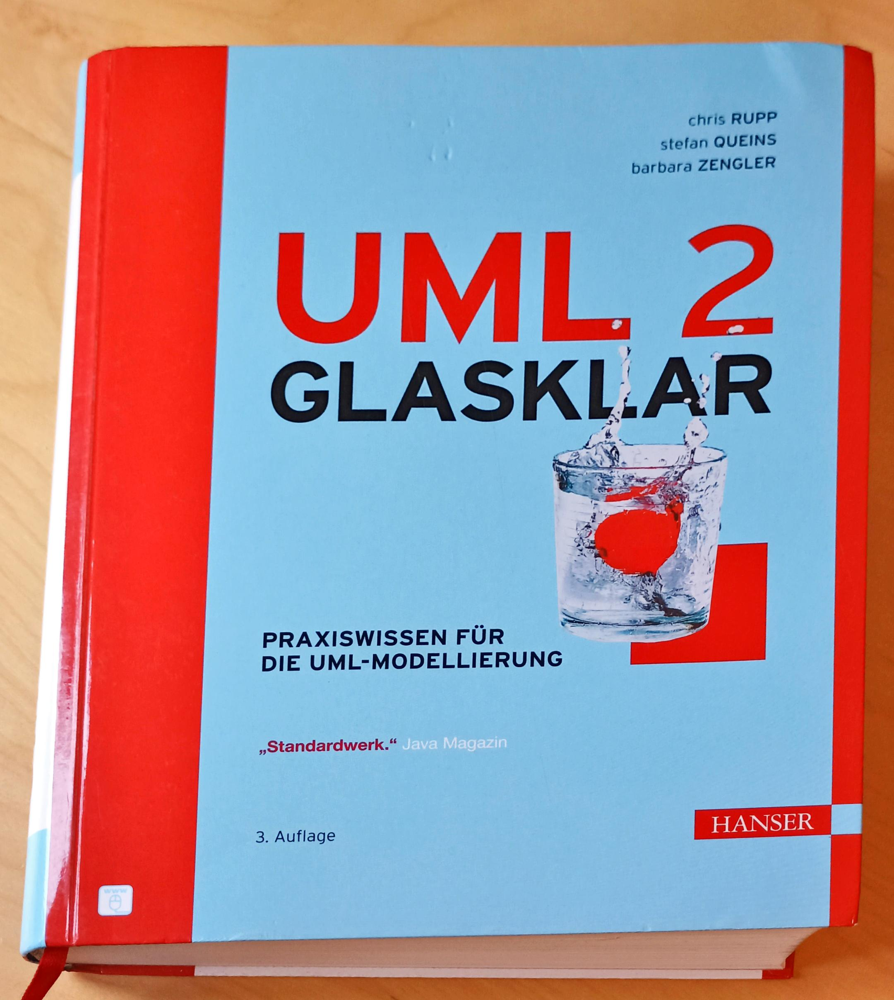

# UML 2 Lerning
This project tracks and documents my efforts and progress in learning UML 2.

I am following the German-language book *UML 2 glasklar* by Chris Rupp, Stefan Queins, and Barbara Zengler. I am using the 3rd edition, published by Hanser in 2007 with the ISBN 978-3-446-41118-0.

This is a pure documentation project. It contains essentially text and UML diagrams.

The diagrams have been created with the [Modelio](33413031) version 5, an open source UML modeling environment.

The approach of this project is to distill the principles of each chapter and accompany the written descriptions of these principles by replications of the UML diagrams shown in the book.

The diagrams are kept as close as possible to the original diagrams with two main differences. Firstly, all German terms have been translated into English. Secondly, the constraints of Modelio as compared to the visualization software used by the authors may introduce other differences to the UML graphics. Those latter differences may be semantic or merely stylistic.

The structure of this project follows the structure of the book. That is to say, each chapter of the book has its own directory. Each of these directories contains the text and UML diagrams related to that chapter.

## Contents
- [Preface](doc/Part-0/Preface/Preface.md)
- [Introduction](doc/Part-0/Introduction/Introduction.md)

### Part I: Introduction
- [Chapter 1: UML 2 – Retrospect, Introspect und Prospect](doc/Part-I/Chapter-1/Chapter-1.md)